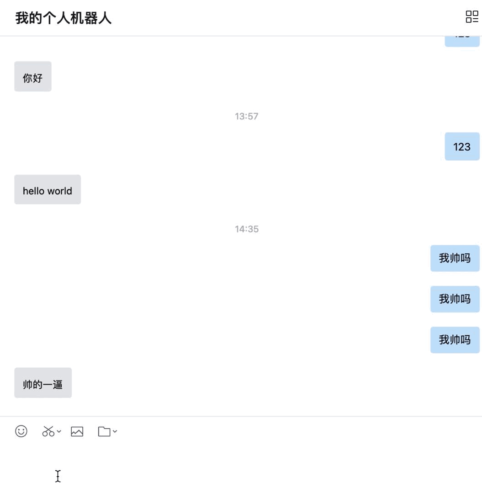

## 预先配置工作
本项目依赖于企业微信创建群聊机器人或应用，要想实现需要先注册一个属于你自己的企业微信号（个人免费），这十分简便，参照[官方网址](https://work.weixin.qq.com/) 即可。

当你有了企业微信后，你还需要做一些配置，根据你自身的需求来做选择：

- **应用消息推送** ：应用消息推送需要在企业微信中创建一个第三方应用，[参照教程](https://open.work.weixin.qq.com/wwopen/helpguide/detail?t=selfBuildApp)
- **群聊机器人消息推送**：群聊机器人消息推送需要在你已有的企业群中添加一个机器人，然后获取相应的机器人`key`（`webhook`最后面），[参照教程](https://jingyan.baidu.com/article/d45ad148cc79eb28552b80b5.html)

当确定你的配置可用后（企业微信后台尝试发送消息看手机上能否接收到），安装`corpwechatbot`到你的pc中，只需要一条命令：

```shell
pip install -U corpwechatbot
```

下面进行消息推送：

## 应用消息推送
> 发送一条文本消息到你设置的应用，在手机个人微信上查看接收

```python
from corpwechatbot.app import AppMsgSender

app = AppMsgSender(corpid='',  # 你的企业id
                   corpsecret='',  # 你的应用凭证密钥
                   agentid='')   # 你的应用id
app.send_text(content="如果我是DJ，你会爱我吗？")
```

推送结果


- **动图演示**


## 群聊机器人消息推送
> 发送一条文本消息到你设置了机器人的群聊

```python
from corpwechatbot.chatbot import CorpWechatBot

bot = CorpWechatBot(key='')  # 你的机器人key，通过群聊添加机器人获取

bot.send_text(content='Hello World')
```

推送结果：


- **动图演示**


## 应用交互（开发测试版）
> 通过回调，你可以给你的用户发送指令，让其执行，解决了应用只能单方面给用户发送消息，而不能回复的困境

- **动图演示**



- **基于回调的任务卡片演示**

  
详细内容查看**Usage**

