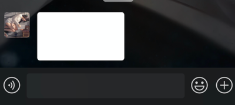
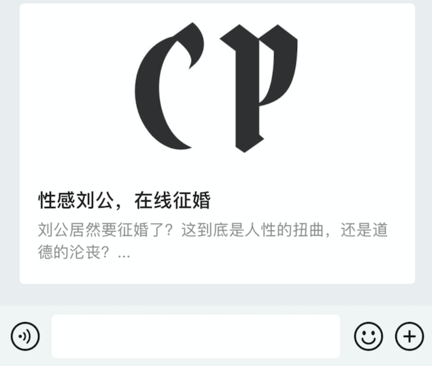
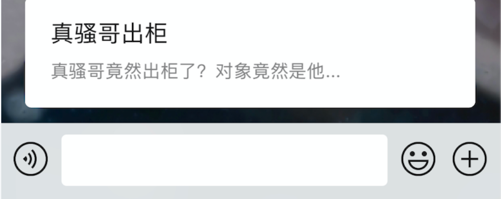
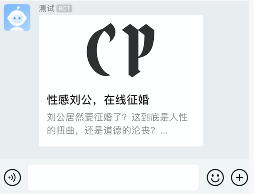
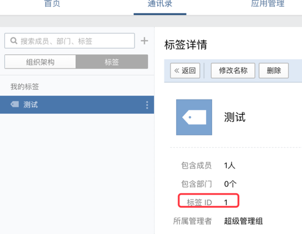
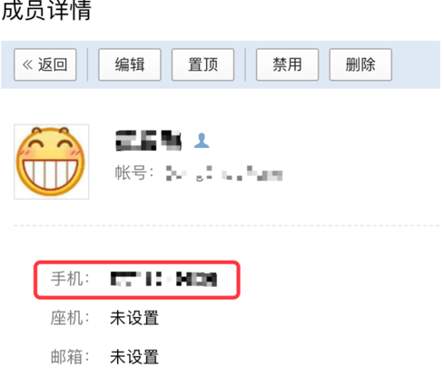

# Usage

Table of Contents
=================

* [Usage](#usage)
  * [应用消息推送](#应用消息推送)
  * [群聊机器人消息推送](#群聊机器人消息推送)
  * [企业微信本地配置文件](#企业微信本地配置文件)
  * [终端快速发送消息](#终端快速发送消息)
  * [更多参数使用](#更多参数使用)
  * [问题反馈](#问题反馈)


## 应用消息推送

该推送会直接传至你的个人微信上，你会像收到好友消息一样收到通知信息，你需要先初始化一个`AppMsgSender`实例对象，如下：
```python
from corpwechatbot.app import AppMsgSender
# from corpwehcatbot import AppMsgSender  # both will work

app = AppMsgSender(corpid='',  # 你的企业id
                   corpsecret='',  # 你的应用凭证密钥
                   agentid='')   # 你的应用id

# 如果你在本地配置添加了企业微信本地配置文件，也可以直接初始化AppMsgSender，而无需再显式传入密钥参数
# app = AppMsgSender()
```
> 在`v0.3.0`之后，你可以创建多个`AppMsgSender`，以实现通过多个不同的应用的消息发送，这让你可以实现在一个项目中跨用户、跨企业的消息通知，下面是一个例子
```python
app1 = AppMsgSender(corpid='1',  # 你的企业id
                   corpsecret='1',  # 你的应用凭证密钥
                   agentid='1')   # 你的应用id
app2 = AppMsgSender(corpid='2',  # 你的企业id
                   corpsecret='2',  # 你的应用凭证密钥
                   agentid='2')   # 你的应用id
app1.send_text('App1的消息') 
app2.send_text('App2的消息')
```

完成实例创建之后，你可以通过接口实现需要的信息推送，具体包括：

- **文本消息**: 最普通的消息，文字内容，最长不超过2048个字节

```python
app.send_text(content="如果我是DJ，你会爱我吗？")
```
> 

- **图片消息**：发送一张图片，可选`jpg,png`，大小不超过2MB，目前仅支持通过图片路径发送.
```python
app.send_image(image_path='test.png')  # 图片存储路径
```
> 

- **语音消息**：发送一条语音，大小不超过2MB，时长不超过60s，必须是`.amr`格式
```python
app.send_voice(voice_path='test.amr')
```
> 

- **视频消息**：发送一段视频，大小不超过10MB，必须是`.mp4`格式
```python
app.send_video(video_path='test.mp4')
```
> 

- **普通文件**：其他类型的文件，大小不超过20MB（不小于5字节）
```python
app.send_file(file_path='test.txt')
```

> 

- **markdown消息（目前仅支持企业微信查看）**：markdown类型消息，支持markdown语法
```python
app.send_markdown(content='# 面对困难的秘诀 \n > 加油，奥利给！')
```
> 

- **图文消息（目前仅支持企业微信查看）**：图片+文字描述+跳转链接
```python
app.send_news(title='性感刘公，在线征婚',
              desp='刘公居然要征婚了？这到底是人性的扭曲，还是道德的沦丧？...',
              url='https://blog.gentlecp.com',
              picurl='https://gitee.com/gentlecp/ImgUrl/raw/master/20210313141425.jpg')
```
> 

- **mpnews图文消息**
```python
app.send_mpnews(title='你好，我是CP',
               image_path='data/test.png',
               content='<a href="https://blog.gentlecp.com">Hello World</a>',
               content_source_url='https://blog.gentlecp.com',
               author='GentleCP',
               digest='这是一段描述',
               safe=1)
```


- **卡片消息**：发送一张卡片，带有跳转链接
```python
app.send_card(title='真骚哥出柜',
              desp='真骚哥竟然出柜了？对象竟然是他...',
              url='https://blog.gentlecp.com',
              btntxt='一睹为快')
```
> 


## 群聊机器人消息推送
> ⚠️注意！机器人发送的群聊只能在企业微信群聊中收到（个人微信中不会显示）！！！

要使用群聊机器人实现消息推送，你需要先实例化一个`CorpWechatBot`对象，如下：
```python
from corpwechatbot.chatbot import CorpWechatBot
# fromo corpwechatbot import CorpWechatBot  # both will work
bot = CorpWechatBot(key='')  # 你的机器人key，通过群聊添加机器人获取

# 如果你在本地配置添加了企业微信本地配置文件，也可以直接初始化AppMsgSender，而无需再显式传入密钥参数
# bot = CorpWechatBot()
```
接着，你就可以利用接口实现快速的机器人群里消息推送，具体包括：
- **文本消息**
```python
bot.send_text(content='Hello World')
```
> 

- **图片消息**
```python
bot.send_image(image_path='test.png')
```
> 

- **markdown消息**
```python
bot.send_markdown(content='# 面对困难的秘诀 \n > 加油，奥利给！')
```
> 

- **图文消息**
```python
bot.send_news(title='性感刘公，在线征婚',
              desp='刘公居然要征婚了？这到底是人性的扭曲，还是道德的沦丧？...',
              url='https://blog.gentlecp.com',
              picurl='https://gitee.com/gentlecp/ImgUrl/raw/master/20210313141425.jpg')
```
> 


## 企业微信本地配置文件
默认情况下，在初始化推送实例的时候，都会要求传入相应的关键参数，但在程序中直接写这些敏感信息并不是一个好选项，因此新版本支持在本地用户目录(`~`)下创建一个`.corpwechatbot_key`文件，写入如下配置信息：

```python
[app]
corpid=  
corpsecret=
agentid=
[chatbot]
key=
```
这样，在实例化一个类时，就不需要再显式地传入`corpid,corpsecret,key`等参数了，如下：

```python
from corpwechatbot.app import AppMsgSender
from corpwechatbot import CorpWechatBot

app = AppMsgSender()  # 不传参，直接从本地`~/.corpwechatbot_key`读取
app.send_text(content="如果我是DJ，你会爱我吗？")

bot = CorpWechatBot()
bot.send_text(content='Hello World!')
```

同时由于配置信息都统一存储在本地，意味着你任何一个新的项目也可以不需要专门设置一个文件来存储这些敏感数据了

> 如果你不知道`~`目录在哪，可以通过如下代码获取：
>
> ```python
> from pathlib import Path
> 
> print(Path.home())
> ```

## 终端快速发送消息
很多时候，我们希望直接在终端敲一行代码就将消息发送到了我们的手机上，在`v0.2.0`版本后支持啦！！！使用前需先按照**企业微信本地配置文件**(因为你总不想在终端传入一堆密钥参数吧)

目前支持：
- **文本消息**：
```python
# 应用消息
cwb -u='app' -t='hello world'  # 通过应用发送消息
cwb -t='hello world'  # 更快捷的方式

# 群聊机器人消息
cwb -u='bot' -t='hello world'
```
- **markdwn消息**
```python
cwb -u='app' -m='hello world'  
cwb -m='# Hello World'  # 更快捷的方式

# 群聊机器人消息
cwb -u='bot' -m='hello world'
```

- **动图演示**


## 更多参数使用

上面只是简单地列出了每个消息推送接口的使用，对于一般使用已经足够了，如果你还有更细致的要求，例如发送给指定人，消息安全性等，需要配置以下参数：
- **应用推送消息**：所有应用推送消息有几个共同参数，用于指定发送消息的特性，如下
    - `touser`: 要发送的用户，通过列表划分，输入成员ID，默认发送给全体
    - `toparty`: 要发送的部门，通过列表划分，输入部门ID，当touser为@all时忽略
    - `totag`: 发送给包含指定标签的人，通过列表划分，输入标签ID，当touser为@all时忽略
    - `safe`(该参数并非所有接口都支持，使用时请确认): 是否是保密消息，`0`表示可对外分享，`1`表示不能分享且内容显示水印，默认为`0`

```python
# 一个演示程序
from corpwechatbot.app import AppMsgSender

app = AppMsgSender(corpid='',  # 你的企业id
                   corpsecret='',  # 你的应用凭证密钥
                   agentid='')   # 你的应用id

app.send_text(content='Hello',
              touser=['sb'],
              toparty=['1'],
              totag=['1'],
              safe=True)
```
> ⚠️注意！在指定`toparty`参数的时候，请确保你应用的可见范围包括该部门，否则会发送失败！


- **群聊推送消息**：群聊消息中发送text消息时可以指定`@`的成员
    - `mentioned_list:[]`: userid列表，提醒群众某个成员，userid通过企业通讯录查看，'@all'则提醒所有人
    - `mentioned_mobile_list:[]`: 手机号列表，提醒手机号对应的成员，'@all'代表所有人，当不清楚userid时可替换

```python
# 一个演示程序
from corpwechatbot.chatbot import CorpWechatBot

bot = CorpWechatBot(key='')  # 你的机器人key，通过群聊添加机器人获取
bot.send_text(content='Hello World',
              mentioned_list=['sb'],
              mentioned_mobile_list=['110'])

```
> 

获取相应数据方法（进入企业微信后台->通讯录）：
- 如何获取userID  

- 如何获取partyID  

- 如何获取tagID  

- 如何获取mobile  


## 问题反馈
如果你未能收到相应的推送结果，请确认如下步骤：
1. 企业微信配置是否正确：包括企业id，应用密钥、应用id，机器人`key`等
2. 是否采用了最新版本的`corpwechatbot`（通常来说只要企业微信的接口不变，就不会有问题）

如果以上都检验通过，麻烦您提交`issue`，作者会及时查看并更新解决